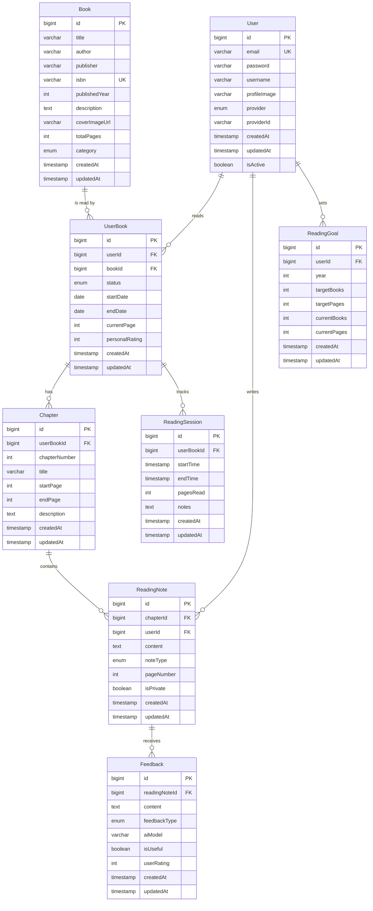

# 개념적 설계 - ERD 및 도메인 모델

## 1. 도메인 모델 개요

### 1.1 핵심 도메인
- **User Domain**: 사용자 인증 및 관리
- **Book Domain**: 책 정보 및 관리
- **Reading Domain**: 독서 진행 및 기록
- **Feedback Domain**: AI 피드백 및 상호작용
- **Analytics Domain**: 통계 및 분석

### 1.2 도메인 간 관계
```
User ──┐
       ├── Reading ──── Book
       └── Feedback ──┘
            │
       Analytics
```

## 2. 엔티티 정의

### 2.1 User (사용자)
```
User
├── id (PK)
├── email (Unique)
├── password (nullable for OAuth)
├── username
├── profileImage
├── provider (LOCAL, GOOGLE)
├── providerId
├── createdAt
├── updatedAt
└── isActive
```

**비즈니스 규칙:**
- 이메일은 고유해야 함
- OAuth 사용자는 비밀번호가 없을 수 있음
- 사용자명은 2-20자 제한

### 2.2 Book (책)
```
Book
├── id (PK)
├── title
├── author
├── publisher
├── isbn
├── publishedYear
├── description
├── coverImageUrl
├── totalPages
├── category
├── createdAt
└── updatedAt
```

**비즈니스 규칙:**
- ISBN은 고유하나 선택사항
- 제목과 저자는 필수
- 카테고리는 enum 타입

### 2.3 UserBook (사용자-책 연결)
```
UserBook
├── id (PK)
├── userId (FK)
├── bookId (FK)
├── status (NOT_STARTED, READING, COMPLETED, PAUSED)
├── startDate
├── endDate
├── currentPage
├── personalRating (1-5)
├── createdAt
└── updatedAt
```

**비즈니스 규칙:**
- 한 사용자는 같은 책을 여러 번 읽을 수 있음
- 상태 변경에 따른 날짜 자동 업데이트
- 완료된 책만 평점 입력 가능

### 2.4 Chapter (목차)
```
Chapter
├── id (PK)
├── userBookId (FK)
├── chapterNumber
├── title
├── startPage
├── endPage
├── description
├── createdAt
└── updatedAt
```

**비즈니스 규칙:**
- 목차 번호는 해당 UserBook 내에서 고유
- 페이지 범위는 겹치지 않음
- 시작 페이지 < 끝 페이지

### 2.5 ReadingNote (독서 기록)
```
ReadingNote
├── id (PK)
├── chapterId (FK)
├── userId (FK)
├── content
├── noteType (IMPRESSION, LEARNING, QUESTION, QUOTE)
├── pageNumber
├── isPrivate
├── createdAt
└── updatedAt
```

**비즈니스 규칙:**
- 내용은 10,000자 제한
- 페이지 번호는 해당 목차 범위 내
- 기본적으로 비공개

### 2.6 Feedback (AI 피드백)
```
Feedback
├── id (PK)
├── readingNoteId (FK)
├── content
├── feedbackType (COMMENT, QUESTION, SUGGESTION)
├── aiModel
├── isUseful (nullable)
├── userRating (1-5, nullable)
├── createdAt
└── updatedAt
```

**비즈니스 규칙:**
- 피드백은 독서 기록에 대해서만 생성
- 사용자 평가는 선택사항
- AI 모델 정보 저장으로 추적 가능

### 2.7 ReadingGoal (독서 목표)
```
ReadingGoal
├── id (PK)
├── userId (FK)
├── year
├── targetBooks
├── targetPages
├── currentBooks
├── currentPages
├── createdAt
└── updatedAt
```

**비즈니스 규칙:**
- 연도별로 하나의 목표만 설정 가능
- 현재 진행도는 계산으로 업데이트

### 2.8 ReadingSession (독서 세션)
```
ReadingSession
├── id (PK)
├── userBookId (FK)
├── startTime
├── endTime
├── pagesRead
├── notes
├── createdAt
└── updatedAt
```

**비즈니스 규칙:**
- 세션은 시작과 종료 시간이 있어야 함
- 읽은 페이지 수는 양수
- 세션별 간단한 메모 가능

## 3. ERD (Entity Relationship Diagram)



## 4. 도메인 서비스 정의

### 4.1 UserService
- 사용자 등록/인증
- 프로필 관리
- OAuth 처리

### 4.2 BookService
- 책 정보 관리
- 책 검색
- 메타데이터 처리

### 4.3 ReadingService
- 독서 진행 관리
- 목차 관리
- 진행률 계산

### 4.4 NoteService
- 독서 기록 CRUD
- 기록 검색/필터링
- 내보내기 기능

### 4.5 FeedbackService
- AI 피드백 생성
- 피드백 관리
- 피드백 평가

### 4.6 AnalyticsService
- 독서 통계 생성
- 목표 달성도 추적
- 리포트 생성

## 5. 비즈니스 규칙 및 제약사항

### 5.1 데이터 무결성
- 사용자는 탈퇴 시 연관 데이터 소프트 삭제
- 책 삭제 시 연관된 독서 기록 보존
- 피드백은 독서 기록 삭제 시 함께 삭제

### 5.2 보안 규칙
- 개인 기록은 작성자만 접근 가능
- 공개 기록도 민감 정보 필터링
- AI 피드백은 익명화된 데이터 사용

### 5.3 성능 고려사항
- 대용량 텍스트 처리를 위한 청크 단위 분할
- 자주 조회되는 통계 데이터 캐시
- 인덱스 최적화 (사용자별, 날짜별)

### 5.4 확장성 고려사항
- 다국어 지원을 위한 국제화 테이블 준비
- 소셜 기능 확장을 위한 팔로우 관계 테이블 예약
- 태그 시스템 도입 가능성 고려

## 6. 도메인 이벤트

### 6.1 독서 관련 이벤트
- BookRegistered: 새 책 등록
- ReadingStarted: 독서 시작
- ChapterCompleted: 목차 완료
- BookCompleted: 책 완료

### 6.2 기록 관련 이벤트
- NoteCreated: 새 기록 작성
- FeedbackRequested: 피드백 요청
- FeedbackGenerated: 피드백 생성

### 6.3 목표 관련 이벤트
- GoalAchieved: 목표 달성
- MilestoneReached: 중간 목표 달성

## 7. 애그리게이트 설계

### 7.1 Reading Aggregate
- **Root**: UserBook
- **Entities**: Chapter, ReadingNote, ReadingSession
- **경계**: 한 사용자의 특정 책 읽기 관련 모든 정보

### 7.2 Feedback Aggregate
- **Root**: Feedback
- **Value Objects**: FeedbackContent, AIModelInfo
- **경계**: 특정 독서 기록에 대한 피드백 정보

### 7.3 Analytics Aggregate
- **Root**: ReadingGoal
- **Value Objects**: Progress, Statistics
- **경계**: 사용자의 독서 목표 및 통계 정보