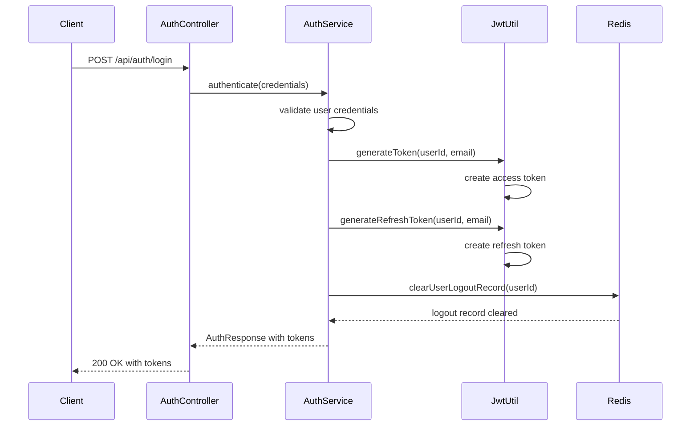
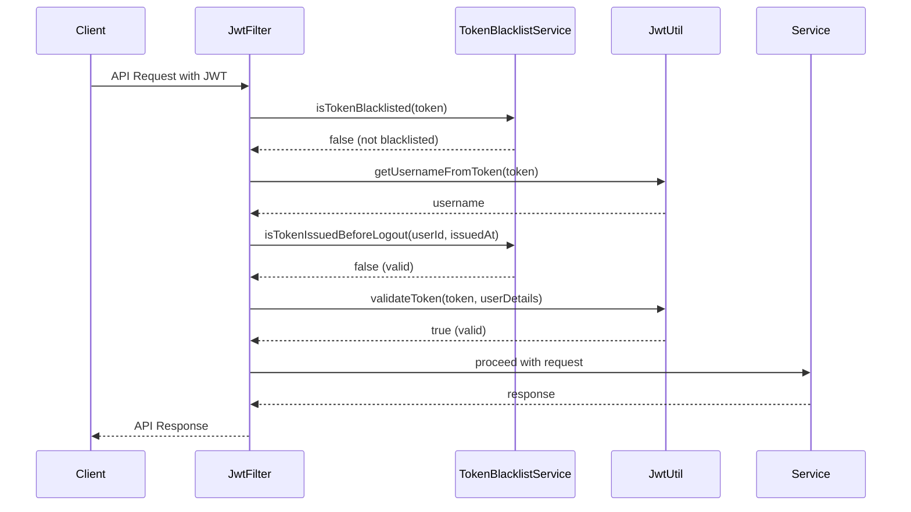
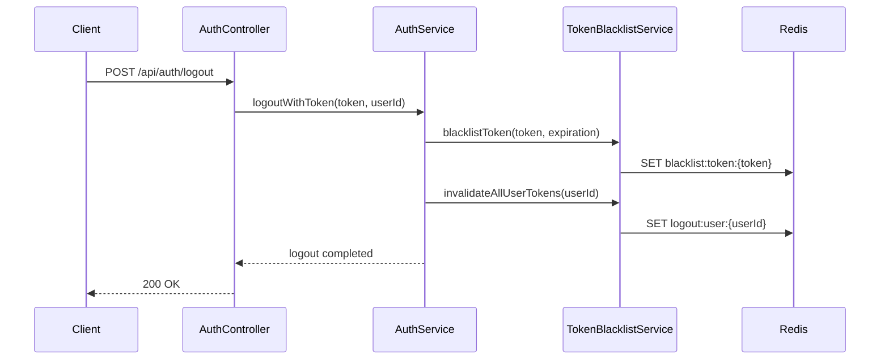

# JWT 토큰 관리 시스템 가이드

## 📋 개요

BookReview-LLM-Platform의 JWT 기반 인증 시스템과 토큰 블랙리스트 관리에 대한 종합 가이드입니다. 보안이 강화된 JWT 구현과 Redis 기반 토큰 관리 시스템을 다룹니다.

---

## 🏗️ JWT 시스템 아키텍처

### 전체 구조
```
┌─────────────────┐    ┌─────────────────┐    ┌─────────────────┐
│   Client App    │    │  Spring Boot    │    │     Redis       │
│                 │    │   Backend       │    │   Token Store   │
├─────────────────┤    ├─────────────────┤    ├─────────────────┤
│ • Access Token  │◄──▶│ • JWT Utils     │◄──▶│ • Blacklist     │
│ • Refresh Token │    │ • Auth Filter   │    │ • User Logout   │
│ • Auto Refresh  │    │ • Auth Service  │    │ • TTL Control   │
└─────────────────┘    └─────────────────┘    └─────────────────┘
```

### 핵심 구성 요소

1. **JwtUtil** - JWT 토큰 생성, 검증, 파싱
2. **JwtAuthenticationFilter** - 요청별 토큰 검증
3. **TokenBlacklistService** - Redis 기반 토큰 무효화
4. **AuthService** - 인증 로직 및 토큰 관리

---

## 🔐 JWT 토큰 구조

### Access Token 구조
```json
{
  "header": {
    "alg": "HS512",
    "typ": "JWT"
  },
  "payload": {
    "sub": "user@example.com",
    "userId": 123,
    "iat": 1690123456,
    "exp": 1690209856
  },
  "signature": "HMACSHA512(base64UrlEncode(header) + '.' + base64UrlEncode(payload), secret)"
}
```

### Refresh Token 구조
```json
{
  "header": {
    "alg": "HS512",
    "typ": "JWT"
  },
  "payload": {
    "sub": "user@example.com",
    "userId": 123,
    "iat": 1690123456,
    "exp": 1692715456
  }
}
```

### 토큰 만료 시간 설정
```properties
# application.yml
jwt:
  expiration: 86400        # Access Token: 24시간 (86400초)
  refresh-expiration: 2592000  # Refresh Token: 30일 (2592000초)
```

---

## 🛠️ JwtUtil 클래스

### 주요 기능

#### 1. 토큰 생성
```java
@Component
public class JwtUtil {
    
    // Access Token 생성
    public String generateToken(Long userId, String username) {
        Map<String, Object> claims = new HashMap<>();
        claims.put("userId", userId);
        return generateToken(claims, username);
    }
    
    // Refresh Token 생성
    public String generateRefreshToken(Long userId, String username) {
        Map<String, Object> claims = new HashMap<>();
        claims.put("userId", userId);
        
        final Date createdDate = new Date();
        final Date expirationDate = new Date(createdDate.getTime() + refreshExpiration * 1000);

        return Jwts.builder()
            .setClaims(claims)
            .setSubject(username)
            .setIssuedAt(createdDate)
            .setExpiration(expirationDate)
            .signWith(getSigningKey(), SignatureAlgorithm.HS512)
            .compact();
    }
}
```

#### 2. 토큰 검증
```java
public Boolean validateToken(String token, UserDetails userDetails) {
    try {
        final String username = getUsernameFromToken(token);
        return username.equals(userDetails.getUsername()) && !isTokenExpired(token);
    } catch (JwtException e) {
        logger.error("JWT validation error: {}", e.getMessage());
        return false;
    }
}
```

#### 3. 보안 강화 기능
```java
private SecretKey getSigningKey() {
    // JWT Secret 키 검증
    if (secret == null || secret.trim().isEmpty()) {
        throw new IllegalArgumentException("JWT secret cannot be null or empty");
    }
    
    // 기본값 사용 경고
    if (secret.equals("default-secret-key-change-in-production")) {
        logger.warn("Using default JWT secret key! This is insecure for production use.");
    }
    
    // 키 길이 검증 (최소 256bit)
    byte[] keyBytes = secret.getBytes();
    if (keyBytes.length < 32) {
        logger.warn("JWT secret key is shorter than recommended 256 bits. Current: {} bytes", 
            keyBytes.length);
    }
    
    return Keys.hmacShaKeyFor(keyBytes);
}
```

---

## 🚫 토큰 블랙리스트 시스템

### Redis 저장 구조

#### 1. 개별 토큰 블랙리스트
```
Key: blacklist:token:{JWT_TOKEN}
Value: "blacklisted"
TTL: 토큰 만료 시간까지
```

#### 2. 사용자 로그아웃 시간 기록
```
Key: logout:user:{USER_ID}
Value: "1690123456789" (로그아웃 타임스탬프)
TTL: 31일 (리프레시 토큰 만료 시간보다 길게)
```

### TokenBlacklistService 주요 메서드

#### 1. 토큰 블랙리스트 추가
```java
@Service
public class TokenBlacklistService {
    
    public void blacklistToken(String token, Date expiration) {
        String key = BLACKLIST_PREFIX + token;
        
        // 이미 만료된 토큰은 블랙리스트에 추가하지 않음
        if (expiration.before(new Date())) {
            log.debug("Token is already expired, skipping blacklist");
            return;
        }
        
        // 토큰 만료 시간까지 Redis에 저장
        Duration ttl = Duration.between(Instant.now(), expiration.toInstant());
        if (ttl.isPositive()) {
            redisTemplate.opsForValue().set(key, "blacklisted", ttl);
            log.debug("Token blacklisted successfully with TTL: {} seconds", ttl.getSeconds());
        }
    }
}
```

#### 2. 블랙리스트 확인
```java
public boolean isTokenBlacklisted(String token) {
    String key = BLACKLIST_PREFIX + token;
    Boolean exists = redisTemplate.hasKey(key);
    
    if (Boolean.TRUE.equals(exists)) {
        log.debug("Token found in blacklist");
        return true;
    }
    
    return false;
}
```

#### 3. 사용자 전체 토큰 무효화
```java
public void invalidateAllUserTokens(Long userId) {
    String key = USER_LOGOUT_PREFIX + userId;
    String logoutTime = String.valueOf(System.currentTimeMillis());
    
    // 로그아웃 시간을 31일간 저장
    redisTemplate.opsForValue().set(key, logoutTime, Duration.ofDays(31));
    
    log.info("All tokens invalidated for user: {}", userId);
}
```

#### 4. 로그아웃 이전 토큰 검증
```java
public boolean isTokenIssuedBeforeLogout(Long userId, Date tokenIssuedAt) {
    String key = USER_LOGOUT_PREFIX + userId;
    String logoutTimeStr = redisTemplate.opsForValue().get(key);
    
    if (logoutTimeStr == null) {
        return false; // 로그아웃 기록이 없으면 유효한 토큰
    }
    
    try {
        long logoutTime = Long.parseLong(logoutTimeStr);
        boolean isInvalidToken = tokenIssuedAt.getTime() < logoutTime;
        
        if (isInvalidToken) {
            log.debug("Token was issued before logout for user: {}", userId);
        }
        
        return isInvalidToken;
    } catch (NumberFormatException e) {
        log.error("Invalid logout time format for user: {}", userId, e);
        return false;
    }
}
```

---

## 🔍 JWT 인증 필터

### JwtAuthenticationFilter 동작 과정

```java
@Component
public class JwtAuthenticationFilter extends OncePerRequestFilter {
    
    @Override
    protected void doFilterInternal(HttpServletRequest request, 
                                  HttpServletResponse response, 
                                  FilterChain filterChain) throws ServletException, IOException {
        
        final String requestHeader = request.getHeader("Authorization");
        String username = null;
        String authToken = null;

        // 1. Authorization 헤더에서 토큰 추출
        if (requestHeader != null && requestHeader.startsWith("Bearer ")) {
            authToken = requestHeader.substring(7);
            
            try {
                // 2. 토큰 블랙리스트 확인 (우선순위 1)
                if (tokenBlacklistService.isTokenBlacklisted(authToken)) {
                    sendErrorResponse(response, "Token has been revoked", 401);
                    return;
                }
                
                // 3. 토큰에서 사용자 정보 추출
                username = jwtUtil.getUsernameFromToken(authToken);
                Long userId = jwtUtil.getUserIdFromToken(authToken);
                
                // 4. 사용자 로그아웃 이후 토큰인지 확인
                if (tokenBlacklistService.isTokenIssuedBeforeLogout(userId, 
                        jwtUtil.getCreatedDateFromToken(authToken))) {
                    sendErrorResponse(response, "Token has been invalidated", 401);
                    return;
                }
                
            } catch (JwtException e) {
                sendErrorResponse(response, "Invalid JWT token", 401);
                return;
            }
        }

        // 5. 사용자 인증 처리
        if (username != null && SecurityContextHolder.getContext().getAuthentication() == null) {
            UserDetails userDetails = userDetailsService.loadUserByUsername(username);
            
            if (jwtUtil.validateToken(authToken, userDetails)) {
                UsernamePasswordAuthenticationToken authentication = 
                    new UsernamePasswordAuthenticationToken(
                        userDetails, null, userDetails.getAuthorities());
                SecurityContextHolder.getContext().setAuthentication(authentication);
            }
        }

        filterChain.doFilter(request, response);
    }
}
```

### 필터 예외 경로 설정
```java
@Override
protected boolean shouldNotFilter(HttpServletRequest request) throws ServletException {
    String path = request.getRequestURI();
    
    // 인증이 필요없는 경로들
    return path.startsWith("/api/auth/") ||
           path.startsWith("/api/public/") ||
           path.startsWith("/actuator/") ||
           path.startsWith("/swagger-ui/") ||
           path.startsWith("/v3/api-docs/");
}
```

---

## 🔄 인증 플로우

### 1. 로그인 플로우


### 2. API 요청 플로우


### 3. 로그아웃 플로우


---

## 🔧 개발자 가이드

### 새 인증 엔드포인트 추가

#### 1. AuthController에 엔드포인트 추가
```java
@RestController
@RequestMapping("/api/auth")
public class AuthController {
    
    @PostMapping("/change-password")
    public ResponseEntity<ApiResponse<Void>> changePassword(
            @Valid @RequestBody ChangePasswordRequest request,
            @CurrentUser UserPrincipal currentUser) {
        
        authService.changePassword(currentUser.getId(), request);
        
        // 비밀번호 변경 시 모든 토큰 무효화
        authService.logout(currentUser.getId());
        
        return ResponseEntity.ok(ApiResponse.success(null));
    }
}
```

#### 2. AuthService에 비즈니스 로직 구현
```java
@Service
@Transactional
public class AuthService {
    
    public void changePassword(Long userId, ChangePasswordRequest request) {
        User user = userRepository.findById(userId)
            .orElseThrow(() -> new NotFoundException(ErrorCode.USER_NOT_FOUND));
        
        // 현재 비밀번호 확인
        if (!passwordEncoder.matches(request.getCurrentPassword(), user.getPassword())) {
            throw new BusinessException(ErrorCode.INVALID_PASSWORD);
        }
        
        // 새 비밀번호 설정
        String encodedPassword = passwordEncoder.encode(request.getNewPassword());
        user.changePassword(encodedPassword);
        userRepository.save(user);
        
        // 보안을 위해 모든 토큰 무효화
        tokenBlacklistService.invalidateAllUserTokens(userId);
    }
}
```

### 커스텀 JWT 클레임 추가

#### 1. 토큰 생성 시 클레임 추가
```java
public String generateTokenWithRoles(Long userId, String username, List<String> roles) {
    Map<String, Object> claims = new HashMap<>();
    claims.put("userId", userId);
    claims.put("roles", roles);
    claims.put("permissions", getPermissions(roles));
    
    return generateToken(claims, username);
}
```

#### 2. 토큰에서 클레임 추출
```java
public List<String> getRolesFromToken(String token) {
    final Claims claims = getClaimsFromToken(token);
    return claims.get("roles", List.class);
}

public List<String> getPermissionsFromToken(String token) {
    final Claims claims = getClaimsFromToken(token);
    return claims.get("permissions", List.class);
}
```

### 토큰 리프레시 구현

#### 1. 리프레시 엔드포인트
```java
@PostMapping("/refresh")
public ResponseEntity<ApiResponse<AuthResponse>> refreshToken(
        @Valid @RequestBody RefreshTokenRequest request) {
    
    AuthResponse response = authService.refreshToken(request.getRefreshToken());
    return ResponseEntity.ok(ApiResponse.success(response));
}
```

#### 2. 리프레시 로직
```java
public AuthResponse refreshToken(String refreshToken) {
    try {
        // 리프레시 토큰 검증
        if (!jwtUtil.validateToken(refreshToken)) {
            throw new UnauthorizedException(ErrorCode.INVALID_REFRESH_TOKEN);
        }
        
        // 사용자 정보 추출
        String username = jwtUtil.getUsernameFromToken(refreshToken);
        Long userId = jwtUtil.getUserIdFromToken(refreshToken);
        
        // 새 액세스 토큰 생성
        String newAccessToken = jwtUtil.generateToken(userId, username);
        
        // 선택적으로 새 리프레시 토큰도 생성
        String newRefreshToken = jwtUtil.generateRefreshToken(userId, username);
        
        return AuthResponse.builder()
            .accessToken(newAccessToken)
            .refreshToken(newRefreshToken)
            .tokenType("Bearer")
            .expiresIn(jwtExpiration)
            .build();
            
    } catch (JwtException e) {
        throw new UnauthorizedException(ErrorCode.INVALID_REFRESH_TOKEN);
    }
}
```

---

## 🧪 테스트 가이드

### JWT 유틸리티 테스트

#### 1. 토큰 생성 및 검증 테스트
```java
@ExtendWith(MockitoExtension.class)
class JwtUtilTest {
    
    @InjectMocks
    private JwtUtil jwtUtil;
    
    @BeforeEach
    void setUp() {
        ReflectionTestUtils.setField(jwtUtil, "secret", 
            "test-secret-key-with-minimum-256-bits-length-for-testing");
        ReflectionTestUtils.setField(jwtUtil, "expiration", 3600L);
    }
    
    @Test
    @DisplayName("JWT 토큰 생성 및 검증 성공")
    void generateAndValidateToken() {
        // Given
        Long userId = 1L;
        String username = "test@example.com";
        
        // When
        String token = jwtUtil.generateToken(userId, username);
        
        // Then
        assertThat(token).isNotNull();
        assertThat(jwtUtil.getUsernameFromToken(token)).isEqualTo(username);
        assertThat(jwtUtil.getUserIdFromToken(token)).isEqualTo(userId);
        assertThat(jwtUtil.validateToken(token)).isTrue();
    }
    
    @Test
    @DisplayName("만료된 토큰 검증 실패")
    void validateExpiredToken() {
        // Given
        ReflectionTestUtils.setField(jwtUtil, "expiration", -1L); // 즉시 만료
        String token = jwtUtil.generateToken(1L, "test@example.com");
        
        // When & Then
        assertThat(jwtUtil.validateToken(token)).isFalse();
    }
}
```

### 토큰 블랙리스트 테스트

#### 2. 블랙리스트 서비스 테스트
```java
@ExtendWith(MockitoExtension.class)
class TokenBlacklistServiceTest {
    
    @Mock
    private RedisTemplate<String, String> redisTemplate;
    
    @Mock
    private ValueOperations<String, String> valueOperations;
    
    @InjectMocks
    private TokenBlacklistService tokenBlacklistService;
    
    @BeforeEach
    void setUp() {
        when(redisTemplate.opsForValue()).thenReturn(valueOperations);
    }
    
    @Test
    @DisplayName("토큰 블랙리스트 추가 성공")
    void blacklistToken() {
        // Given
        String token = "test.jwt.token";
        Date expiration = new Date(System.currentTimeMillis() + 3600000); // 1시간 후
        
        // When
        tokenBlacklistService.blacklistToken(token, expiration);
        
        // Then
        verify(valueOperations).set(
            eq("blacklist:token:" + token),
            eq("blacklisted"),
            any(Duration.class)
        );
    }
    
    @Test
    @DisplayName("블랙리스트된 토큰 확인")
    void isTokenBlacklisted() {
        // Given
        String token = "test.jwt.token";
        when(redisTemplate.hasKey("blacklist:token:" + token)).thenReturn(true);
        
        // When
        boolean result = tokenBlacklistService.isTokenBlacklisted(token);
        
        // Then
        assertThat(result).isTrue();
    }
}
```

### 인증 통합 테스트

#### 3. 인증 플로우 통합 테스트
```java
@SpringBootTest
@AutoConfigureTestDatabase(replace = AutoConfigureTestDatabase.Replace.NONE)
@Testcontainers
class AuthIntegrationTest {
    
    @Container
    static GenericContainer<?> redis = new GenericContainer<>("redis:6-alpine")
        .withExposedPorts(6379);
    
    @Autowired
    private TestRestTemplate restTemplate;
    
    @Autowired
    private UserRepository userRepository;
    
    @Test
    @DisplayName("로그인 후 인증이 필요한 API 호출 성공")
    void loginAndAccessProtectedEndpoint() {
        // Given: 테스트 사용자 생성
        User testUser = createTestUser();
        
        // When: 로그인
        LoginRequest loginRequest = new LoginRequest("test@example.com", "password");
        ResponseEntity<ApiResponse> loginResponse = restTemplate.postForEntity(
            "/api/auth/login", loginRequest, ApiResponse.class);
        
        // Then: 로그인 성공 확인
        assertThat(loginResponse.getStatusCode()).isEqualTo(HttpStatus.OK);
        
        Map<String, Object> authData = (Map<String, Object>) loginResponse.getBody().getData();
        String accessToken = (String) authData.get("accessToken");
        
        // When: 인증이 필요한 API 호출
        HttpHeaders headers = new HttpHeaders();
        headers.setBearerAuth(accessToken);
        HttpEntity<String> entity = new HttpEntity<>(headers);
        
        ResponseEntity<ApiResponse> protectedResponse = restTemplate.exchange(
            "/api/users/me", HttpMethod.GET, entity, ApiResponse.class);
        
        // Then: 보호된 리소스 접근 성공
        assertThat(protectedResponse.getStatusCode()).isEqualTo(HttpStatus.OK);
    }
    
    @Test
    @DisplayName("로그아웃 후 토큰 무효화")
    void logoutInvalidatesToken() {
        // Given: 로그인된 사용자
        String accessToken = loginAndGetToken();
        
        // When: 로그아웃
        HttpHeaders headers = new HttpHeaders();
        headers.setBearerAuth(accessToken);
        HttpEntity<String> entity = new HttpEntity<>(headers);
        
        ResponseEntity<ApiResponse> logoutResponse = restTemplate.exchange(
            "/api/auth/logout", HttpMethod.POST, entity, ApiResponse.class);
        
        // Then: 로그아웃 성공
        assertThat(logoutResponse.getStatusCode()).isEqualTo(HttpStatus.OK);
        
        // When: 로그아웃된 토큰으로 API 호출
        ResponseEntity<ApiResponse> protectedResponse = restTemplate.exchange(
            "/api/users/me", HttpMethod.GET, entity, ApiResponse.class);
        
        // Then: 인증 실패
        assertThat(protectedResponse.getStatusCode()).isEqualTo(HttpStatus.UNAUTHORIZED);
    }
}
```

---

## 📊 모니터링 및 로깅

### JWT 관련 메트릭스

#### 1. Micrometer 메트릭스
```java
@Component
public class JwtMetrics {
    
    private final Counter tokenGenerationCounter;
    private final Counter tokenValidationCounter;
    private final Counter tokenBlacklistCounter;
    private final Timer tokenValidationTimer;
    
    public JwtMetrics(MeterRegistry meterRegistry) {
        this.tokenGenerationCounter = Counter.builder("jwt.token.generated")
            .description("Number of JWT tokens generated")
            .register(meterRegistry);
            
        this.tokenValidationCounter = Counter.builder("jwt.token.validated")
            .description("Number of JWT tokens validated")
            .tag("result", "success")
            .register(meterRegistry);
            
        this.tokenBlacklistCounter = Counter.builder("jwt.token.blacklisted")
            .description("Number of tokens added to blacklist")
            .register(meterRegistry);
            
        this.tokenValidationTimer = Timer.builder("jwt.validation.duration")
            .description("JWT token validation duration")
            .register(meterRegistry);
    }
}
```

#### 2. 로깅 전략
```java
@Component
public class JwtEventLogger {
    
    private static final Logger securityLogger = LoggerFactory.getLogger("SECURITY");
    
    @EventListener
    public void handleTokenGenerated(TokenGeneratedEvent event) {
        securityLogger.info("JWT token generated for user: {} from IP: {}", 
            event.getUsername(), event.getClientIp());
    }
    
    @EventListener
    public void handleTokenBlacklisted(TokenBlacklistedEvent event) {
        securityLogger.warn("JWT token blacklisted for user: {} reason: {}", 
            event.getUserId(), event.getReason());
    }
    
    @EventListener
    public void handleInvalidTokenAttempt(InvalidTokenEvent event) {
        securityLogger.warn("Invalid JWT token attempt from IP: {} token: {}", 
            event.getClientIp(), event.getTokenPrefix());
    }
}
```

### Redis 모니터링

#### 3. Redis 연결 및 성능 모니터링
```java
@Component
public class RedisHealthIndicator implements HealthIndicator {
    
    private final RedisTemplate<String, String> redisTemplate;
    
    @Override
    public Health health() {
        try {
            String result = redisTemplate.execute(connection -> {
                return connection.ping();
            });
            
            if ("PONG".equals(result)) {
                return Health.up()
                    .withDetail("redis", "Available")
                    .withDetail("blacklist_keys", getBlacklistKeysCount())
                    .build();
            }
        } catch (Exception e) {
            return Health.down()
                .withDetail("redis", "Unavailable")
                .withException(e)
                .build();
        }
        
        return Health.down().withDetail("redis", "Unknown").build();
    }
    
    private long getBlacklistKeysCount() {
        Set<String> keys = redisTemplate.keys("blacklist:token:*");
        return keys != null ? keys.size() : 0;
    }
}
```

---

## 🚨 보안 고려사항

### 1. JWT Secret 관리

#### ✅ 권장사항
- 환경변수 또는 보안 볼트 사용
- 최소 256비트 (32바이트) 길이
- 정기적인 키 로테이션
- 환경별 다른 키 사용

#### ❌ 피해야 할 사항
```java
// Bad: 하드코딩
private String secret = "my-secret-key";

// Bad: 짧은 키
private String secret = "short";

// Bad: 예측 가능한 키
private String secret = "password123";
```

### 2. 토큰 만료 시간 설정

#### 권장 설정값
```yaml
jwt:
  expiration: 900         # Access Token: 15분 (높은 보안)
  expiration: 3600        # Access Token: 1시간 (일반적)
  expiration: 86400       # Access Token: 24시간 (편의성 우선)
  
  refresh-expiration: 604800    # Refresh Token: 7일
  refresh-expiration: 2592000   # Refresh Token: 30일
```

### 3. 토큰 저장 위치

#### 클라이언트 저장 옵션
| 저장 위치 | 보안성 | 편의성 | 권장도 |
|-----------|--------|--------|--------|
| localStorage | 낮음 | 높음 | ❌ XSS 취약 |
| sessionStorage | 중간 | 중간 | ⚠️ 탭 종료 시 삭제 |
| Secure Cookie | 높음 | 낮음 | ✅ httpOnly 권장 |
| Memory | 높음 | 낮음 | ✅ 새로고침 시 삭제 |

---

## 📚 문제 해결 가이드

### 자주 발생하는 문제들

#### 1. "Invalid JWT token" 에러
```java
// 원인 분석
@ExceptionHandler(JwtException.class)
public ResponseEntity<?> handleJwtException(JwtException e) {
    if (e instanceof ExpiredJwtException) {
        return ResponseEntity.status(401)
            .body(ApiResponse.error("AUTH003", "토큰이 만료되었습니다."));
    } else if (e instanceof MalformedJwtException) {
        return ResponseEntity.status(401)
            .body(ApiResponse.error("AUTH002", "잘못된 형식의 토큰입니다."));
    } else if (e instanceof SignatureException) {
        return ResponseEntity.status(401)
            .body(ApiResponse.error("AUTH005", "토큰 서명이 유효하지 않습니다."));
    }
    
    return ResponseEntity.status(401)
        .body(ApiResponse.error("AUTH002", "유효하지 않은 JWT 토큰입니다."));
}
```

#### 2. Redis 연결 실패 시 처리
```java
@Service
public class TokenBlacklistService {
    
    public boolean isTokenBlacklisted(String token) {
        try {
            String key = BLACKLIST_PREFIX + token;
            Boolean exists = redisTemplate.hasKey(key);
            return Boolean.TRUE.equals(exists);
        } catch (Exception e) {
            // Redis 연결 실패 시 로깅하고 false 반환 (페일 오픈)
            log.error("Redis connection failed during blacklist check", e);
            return false;
        }
    }
}
```

#### 3. 토큰 갱신 시점 관리
```javascript
// 클라이언트 측 토큰 갱신 로직
class TokenManager {
    
    async makeRequest(url, options = {}) {
        let token = this.getAccessToken();
        
        // 토큰 만료 5분 전에 갱신
        if (this.shouldRefreshToken(token)) {
            token = await this.refreshAccessToken();
        }
        
        return fetch(url, {
            ...options,
            headers: {
                ...options.headers,
                'Authorization': `Bearer ${token}`
            }
        });
    }
    
    shouldRefreshToken(token) {
        const payload = JSON.parse(atob(token.split('.')[1]));
        const expirationTime = payload.exp * 1000;
        const currentTime = Date.now();
        const fiveMinutes = 5 * 60 * 1000;
        
        return (expirationTime - currentTime) < fiveMinutes;
    }
}
```

---

## 📞 문의 및 지원

**개발팀 연락처**: dev-team@bookreview.com  
**보안팀 연락처**: security@bookreview.com  
**JWT 관련 문의**: jwt-support@bookreview.com

JWT 토큰 관리 시스템 관련 문의나 보안 이슈 발견 시 즉시 연락해 주시기 바랍니다.

**문서 버전**: v1.0  
**최종 업데이트**: 2025-07-23