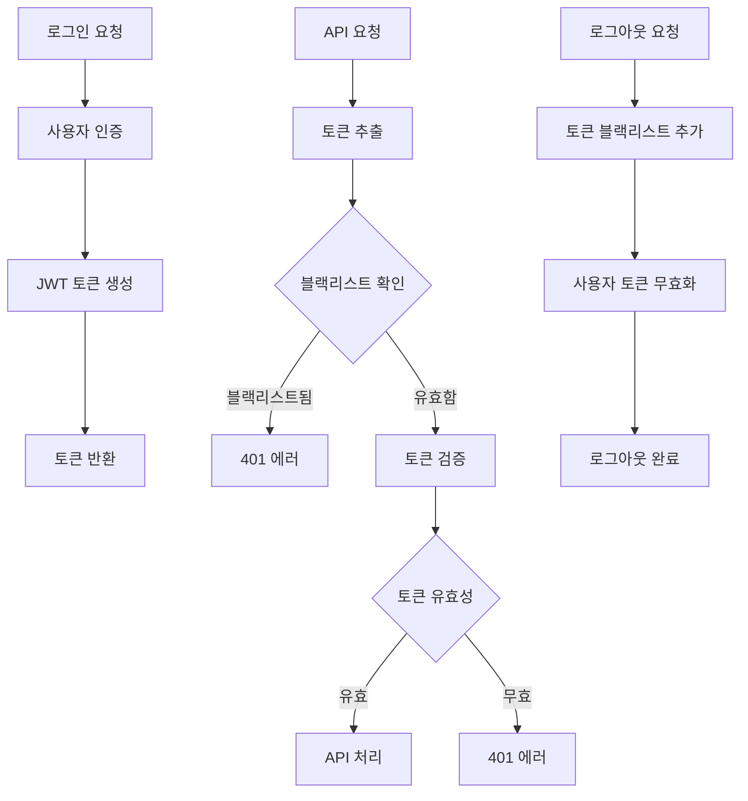

# 보안 강화 가이드

## 📋 개요

BookReview-LLM-Platform 백엔드 애플리케이션의 보안 강화 사항에 대한 상세 가이드입니다. 본 문서는 개발자와 운영자가 보안 설정을 올바르게 이해하고 적용할 수 있도록 작성되었습니다.

---

## 🔐 JWT 토큰 보안

### 1. JWT Secret 관리

#### 🚨 기존 문제점
```yaml
# ❌ 취약한 설정 (기존)
jwt:
  secret: "default-secret-key-change-in-production"
```

#### ✅ 개선된 설정
```yaml
# ✅ 보안 강화된 설정
jwt:
  secret: ${JWT_SECRET:bookreview-super-secret-key-minimum-256-bits-for-production-security}
  expiration: ${JWT_EXPIRATION:86400}
  refresh-expiration: ${JWT_REFRESH_EXPIRATION:2592000}
```

#### 🔧 Secret 키 생성 방법
```bash
# 1. OpenSSL 사용 (권장)
openssl rand -base64 64

# 2. 온라인 생성기 사용
# https://generate-secret.now.sh/64

# 3. 프로그래밍 방식 생성
node -e "console.log(require('crypto').randomBytes(64).toString('base64'))"
```

#### ⚠️ Secret 키 보안 요구사항
- **최소 길이**: 32바이트 (256비트)
- **복잡성**: 영문자, 숫자, 특수문자 조합
- **유니크성**: 환경별로 다른 키 사용
- **저장 방식**: 환경 변수 또는 보안 볼트 사용

### 2. 토큰 블랙리스트 시스템

#### 🏗️ 아키텍처 구성
```
┌─────────────────┐    ┌─────────────────┐    ┌─────────────────┐
│   Client App    │    │  Spring Boot    │    │     Redis       │
│                 │    │   Backend       │    │   Blacklist     │
├─────────────────┤    ├─────────────────┤    ├─────────────────┤
│ JWT Token       │───▶│ Authentication  │───▶│ Token Storage   │
│ API Request     │    │ Filter          │    │ TTL Management  │
└─────────────────┘    └─────────────────┘    └─────────────────┘
```

#### 📝 주요 기능

**1. 토큰 블랙리스트 추가**
```java
@Service
public class TokenBlacklistService {
    
    // 특정 토큰을 블랙리스트에 추가
    public void blacklistToken(String token, Date expiration) {
        String key = BLACKLIST_PREFIX + token;
        Duration ttl = Duration.between(Instant.now(), expiration.toInstant());
        
        if (ttl.isPositive()) {
            redisTemplate.opsForValue().set(key, "blacklisted", ttl);
        }
    }
}
```

**2. 블랙리스트 검증**
```java
// JWT 인증 필터에서 토큰 검증
if (tokenBlacklistService.isTokenBlacklisted(authToken)) {
    sendErrorResponse(response, "Token has been revoked", 401);
    return;
}
```

**3. 사용자 전체 토큰 무효화**
```java
// 로그아웃 시 사용자의 모든 토큰 무효화
public void invalidateAllUserTokens(Long userId) {
    String key = USER_LOGOUT_PREFIX + userId;
    String logoutTime = String.valueOf(System.currentTimeMillis());
    redisTemplate.opsForValue().set(key, logoutTime, Duration.ofDays(31));
}
```

### 3. 토큰 라이프사이클 관리

#### 🔄 토큰 생성 → 검증 → 무효화 플로우



---

## 🛡️ 환경별 보안 설정

### 1. 개발 환경 vs 프로덕션 환경

#### 🏗️ SecurityConfig 환경 분리
```java
@Configuration
@EnableWebSecurity
public class SecurityConfig {
    
    @Value("${spring.profiles.active:dev}")
    private String activeProfile;
    
    @Bean
    public SecurityFilterChain filterChain(HttpSecurity http) throws Exception {
        return http
            .authorizeHttpRequests(auth -> auth
                // 개발 환경에서만 접근 허용
                .requestMatchers("/swagger-ui/**").access(this::isDevEnvironment)
                .requestMatchers("/actuator/**").access(this::isDevEnvironment)
                // 기타 설정...
            )
            .build();
    }
    
    private AuthorizationDecision isDevEnvironment(RequestAuthorizationContext context) {
        boolean isDev = "dev".equals(activeProfile) || "test".equals(activeProfile);
        return new AuthorizationDecision(isDev);
    }
}
```

### 2. CORS 정책 환경별 설정

#### 🌐 개발 환경 CORS
```java
// 개발/테스트 환경: localhost 허용
configuration.setAllowedOriginPatterns(Arrays.asList(
    "http://localhost:*",
    "http://127.0.0.1:*",
    "https://localhost:*",
    "https://127.0.0.1:*"
));
```

#### 🔒 프로덕션 환경 CORS
```java
// 프로덕션 환경: 특정 도메인만 허용
configuration.setAllowedOrigins(Arrays.asList(
    "https://yourdomain.com",
    "https://www.yourdomain.com"
));
```

### 3. Actuator 엔드포인트 보안

#### 📊 개발 환경 설정
```yaml
# application-dev.yml
management:
  endpoints:
    web:
      exposure:
        include: "*"  # 모든 엔드포인트 노출
  endpoint:
    health:
      show-details: always
```

#### 🔐 프로덕션 환경 설정
```yaml
# application-prod.yml
management:
  endpoints:
    web:
      exposure:
        include: health,info,metrics,prometheus  # 제한적 노출
  endpoint:
    health:
      show-details: when_authorized  # 인증된 사용자만
```

---

## 🔍 취약점 스캔 및 모니터링

### 1. 보안 헤더 설정

#### 🛡️ HTTP 보안 헤더
```java
.headers(headers -> headers
    .frameOptions(frameOptions -> frameOptions.deny())  // X-Frame-Options: DENY
    .contentTypeOptions(contentTypeOptions -> contentTypeOptions.and())  // X-Content-Type-Options: nosniff
    .httpStrictTransportSecurity(hstsConfig -> hstsConfig  // HSTS
        .maxAgeInSeconds(31536000))  // 1년
    .referrerPolicy(referrerPolicy -> referrerPolicy  // Referrer-Policy
        .policy(ReferrerPolicyHeaderWriter.ReferrerPolicy.SAME_ORIGIN))
    .cacheControl(cacheControl -> cacheControl.and())  // Cache-Control
)
```

### 2. 입력 검증 및 XSS 방어

#### 🔍 XSS 패턴 검출
```java
@Component
public class XSSValidator implements ConstraintValidator<NoXSS, String> {
    
    private static final Pattern[] XSS_PATTERNS = {
        Pattern.compile("<script[^>]*>.*?</script>", CASE_INSENSITIVE),
        Pattern.compile("javascript:", CASE_INSENSITIVE),
        Pattern.compile("on\\w+\\s*=", CASE_INSENSITIVE)
        // 추가 패턴들...
    };
    
    @Override
    public boolean isValid(String value, ConstraintValidatorContext context) {
        if (value == null) return true;
        
        for (Pattern pattern : XSS_PATTERNS) {
            if (pattern.matcher(value).find()) {
                return false;
            }
        }
        return true;
    }
}
```

### 3. SQL Injection 방어

#### 🛡️ JPA Repository 안전한 사용
```java
@Repository
public interface BookRepository extends JpaRepository<Book, Long> {
    
    // ✅ 안전한 방법: 메서드명 기반 쿼리
    List<Book> findByTitleContainingIgnoreCase(String title);
    
    // ✅ 안전한 방법: 파라미터 바인딩
    @Query("SELECT b FROM Book b WHERE b.title LIKE %:title%")
    List<Book> searchByTitle(@Param("title") String title);
    
    // ❌ 위험한 방법: 문자열 연결 (사용 금지)
    // @Query(value = "SELECT * FROM books WHERE title = '" + title + "'", nativeQuery = true)
}
```

---

## 🚨 보안 사고 대응 절차

### 1. JWT 토큰 탈취 의심 시

#### 🆘 즉시 대응 절차
1. **영향 범위 파악**
   ```bash
   # Redis에서 의심스러운 토큰 활동 확인
   redis-cli KEYS "blacklist:token:*"
   redis-cli KEYS "logout:user:*"
   ```

2. **사용자 토큰 무효화**
   ```java
   // 특정 사용자의 모든 토큰 무효화
   authService.logout(suspiciousUserId);
   ```

3. **시스템 전체 토큰 무효화** (최후 수단)
   ```bash
   # JWT Secret 변경으로 모든 토큰 무효화
   export JWT_SECRET="new-emergency-secret-key"
   # 애플리케이션 재시작 필요
   ```

### 2. 보안 로그 모니터링

#### 📊 중요 보안 이벤트
```java
// 로그인 실패 감지
@EventListener
public void handleAuthenticationFailure(AuthenticationFailureEvent event) {
    String username = event.getAuthentication().getName();
    String clientIp = getClientIp(event.getSource());
    
    log.warn("Login failed for user: {} from IP: {}", username, clientIp);
    
    // 임계치 초과 시 계정 잠금
    if (failureCount.get(username) > MAX_FAILURE_COUNT) {
        lockAccount(username);
    }
}
```

#### 🔔 알람 설정
```yaml
# Prometheus + Grafana 알람 조건
- alert: HighFailedLoginRate
  expr: rate(auth_failure_total[5m]) > 10
  for: 1m
  annotations:
    summary: "High number of failed login attempts detected"
```

---

## 📚 보안 체크리스트

### 🔒 배포 전 필수 체크리스트

#### JWT 보안
- [ ] JWT_SECRET 환경변수 설정 (최소 32바이트)
- [ ] 기본 Secret 키 사용하지 않음
- [ ] 토큰 만료시간 적절히 설정
- [ ] 리프레시 토큰 구현 및 검증

#### 데이터베이스 보안
- [ ] DB 패스워드 환경변수 설정
- [ ] 최소 권한 원칙 적용
- [ ] SSL/TLS 연결 활성화
- [ ] 정기 백업 및 암호화

#### 네트워크 보안
- [ ] HTTPS 강제 설정
- [ ] CORS 정책 환경별 설정
- [ ] 방화벽 규칙 적용
- [ ] DDoS 방어 설정

#### 애플리케이션 보안
- [ ] 입력 검증 구현
- [ ] XSS 방어 활성화
- [ ] SQL Injection 방어 확인
- [ ] 에러 정보 노출 차단

#### 모니터링 및 로깅
- [ ] 보안 이벤트 로깅
- [ ] 실시간 모니터링 설정
- [ ] 알람 임계치 설정
- [ ] 정기 보안 감사

---

## 🔄 정기 보안 점검

### 월간 보안 점검 항목
- [ ] 의존성 취약점 스캔
- [ ] 보안 패치 적용
- [ ] 접근 로그 분석
- [ ] 비정상 트래픽 패턴 확인

### 분기별 보안 감사
- [ ] 코드 보안 리뷰
- [ ] 침투 테스트 수행
- [ ] 보안 정책 업데이트
- [ ] 직원 보안 교육

---

## 📞 보안 문의 및 신고

**보안팀 연락처**: security@bookreview.com  
**긴급 보안 사고**: +82-10-XXXX-XXXX  
**취약점 신고**: security-report@bookreview.com  

보안 관련 문의나 취약점 발견 시 즉시 보안팀으로 연락해 주시기 바랍니다.

---

## 📚 참고 자료

### 보안 가이드라인
- [OWASP Top 10](https://owasp.org/www-project-top-ten/)
- [Spring Security Reference](https://docs.spring.io/spring-security/reference/)
- [JWT Best Practices](https://datatracker.ietf.org/doc/html/rfc8725)

### 도구 및 라이브러리
- [OWASP Dependency Check](https://owasp.org/www-project-dependency-check/)
- [Snyk](https://snyk.io/) - 취약점 스캔
- [SonarQube](https://www.sonarqube.org/) - 정적 분석

**문서 버전**: v1.0  
**최종 업데이트**: 2025-07-23